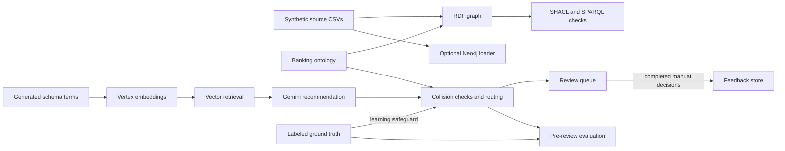

# Graph Schema Intelligence System (GSIS) for Banking

GSIS is a 15-stage learning pipeline for governing schema evolution across retail-banking systems. It profiles heterogeneous source schemas, maps incoming terms to an RDF/OWL ontology with Vertex AI embeddings and Gemini, detects semantic collisions, routes uncertain decisions to human review, validates the resulting knowledge graph, and measures the pipeline against labeled ground truth.

The repository uses deterministic synthetic banking data. It is an educational portfolio project, not a production banking platform.

## Why this project exists

Large organizations often describe the same concept differently across systems: `customer`, `client`, `card_holder`, and `subject` may all refer to a banking customer. Blindly creating a new graph class for every incoming term causes duplicate concepts, broken lineage, and inconsistent analytics.

GSIS treats schema onboarding as a governed decision:

- reuse an existing ontology concept;
- create a genuinely new concept;
- reject a semantically incompatible mapping; or
- escalate an uncertain decision to a reviewer.

## Architecture



The graph checks, schema mapping, and Neo4j load are separate paths. The current collision detector reads labeled ground truth, so its routing behavior is specific to this learning setup. See [docs/ARCHITECTURE.md](docs/ARCHITECTURE.md) for the detailed component contracts and data flow.

## The 15 stages

| Stage | Component | Purpose | Primary output |
|---:|---|---|---|
| 1 | `generate_banking_data.py` | Generate reproducible multi-source banking data | `data/raw/` |
| 2 | `profile_schema.py` | Profile 49 fields and identify overlaps | `data/processed/` |
| 3 | `inspect_ontology.py` | Inspect the banking RDF/OWL model | Console inspection |
| 4 | `build_graph.py` | Build the RDF banking knowledge graph | `outputs/rdf/` |
| 5 | `run_shacl.py` | Validate graph constraints | SHACL report |
| 6 | `run_sparql_checks.py` | Run referential and duplicate checks | Validation CSVs |
| 7 | `vertex_embeddings.py` | Embed ontology and incoming terms | Embedding CSVs |
| 8 | `vector_search.py` | Retrieve the top three candidate concepts | `vector_candidates.csv` |
| 9 | `gemini_mapper.py` | Select reuse/create decisions with Gemini | `gemini_mappings.csv` |
| 10 | `collision_detector.py` | Detect ontology and semantic conflicts | `collision_results.csv` |
| 11 | `confidence_router.py` | Combine model scores and governance signals | `confidence_routing.csv` |
| 12 | `review_manager.py` | Manage approvals, remaps, and new concepts | Review and feedback CSVs |
| 13 | `replacement_engine.py` | Estimate deprecation and migration impact | `deprecation_impact.csv` |
| 14 | `load_neo4j.py` | Load customers, accounts, and transactions | Neo4j property graph |
| 15 | `evaluate_pipeline.py` | Compare predictions with ground truth | Evaluation metrics |

`feedback_retriever.py` demonstrates the feedback-memory loop after review.

## Results from the recorded run

These are the repository's actual generated results, not target values.

| Measure | Recorded result |
|---|---:|
| Synthetic source systems/files | 6 |
| Synthetic source records | 4,450 |
| Profiled schema fields | 49 |
| Banking ontology triples | 269 |
| Complete RDF graph triples | 41,799 |
| Incoming mappings evaluated | 12 |
| Pre-review mapping accuracy | 66.67% |
| Human-intervention rate | 100% |
| Auto-approval coverage | 0% |
| Semantic collisions detected | 1 |
| Collision recall | 50% |
| Completed review decisions | 12 |
| SHACL violations | 5 |
| SPARQL quality rules passed | 4 of 7 |

The conservative confidence thresholds deliberately sent every mapping to soft review or human escalation. That result is useful: it exposes calibration work still needed before automated governance is safe. Human review corrected `merchant_ref` to `Merchant`, remapped fraud-system `subject` to `Customer`, and approved `DigitalWallet` as a new concept.

## Validation findings

The intentionally injected data-quality cases were detected:

- one account referenced a missing customer;
- one card referenced a missing account;
- one risk event referenced a missing transaction;
- one transaction used unsupported currency `XYZ`;
- one transaction had a negative amount.

Duplicate customer IDs, duplicate account IDs, missing transaction customers, and missing transaction accounts passed their SPARQL checks.

## Technology

- Python 3.11+
- pandas and NumPy
- RDFLib, RDF/OWL, SHACL, and SPARQL
- Google Vertex AI `gemini-embedding-001`
- Gemini 2.5 Flash through the Google Gen AI SDK
- Neo4j Python driver

## Setup

```powershell
git clone <private-repository-url>
cd gsis-banking
python -m venv .venv
.\.venv\Scripts\Activate.ps1
python -m pip install -r requirements.txt
```

Authenticate for Vertex AI:

```powershell
gcloud auth application-default login
$env:GOOGLE_CLOUD_PROJECT="your-project-id"
$env:GOOGLE_CLOUD_LOCATION="us-central1"
```

Never commit credentials. Copy `.env.example` only as a reference and set secrets in the shell or a secret manager.

## Run the pipeline

Run the stages from the repository root:

```powershell
python .\src\generate_banking_data.py
python .\src\profiling\profile_schema.py
python .\src\ontology\inspect_ontology.py
python .\src\rdf\build_graph.py
python .\src\validation\run_shacl.py
python .\src\validation\run_sparql_checks.py
python .\src\embeddings\vertex_embeddings.py
python .\src\embeddings\vector_search.py
python .\src\mapping\gemini_mapper.py
python .\src\mapping\collision_detector.py
python .\src\mapping\confidence_router.py
python .\src\review\review_manager.py
python .\src\migration\replacement_engine.py
python .\src\evaluation\evaluate_pipeline.py
```

Stages 7 and 9 send the schema descriptions in `data/schemas/` to Vertex AI and can incur cloud charges. Stage 14 is optional and requires a running Neo4j database:

```powershell
$env:NEO4J_URI="neo4j://localhost:7687"
$env:NEO4J_USER="neo4j"
$env:NEO4J_PASSWORD="your-password"
python .\src\neo4j\load_neo4j.py
```

Database deletion is disabled by default. Set `NEO4J_CLEAR_DATABASE=true` only when you intentionally want a clean demo database.

## Repository structure

```text
data/                 synthetic source data, schema terms, and ground truth
ontology/             banking RDF/OWL ontology and versions
outputs/              recorded embeddings, mappings, reviews, validations, and metrics
queries/              SPARQL checks
shapes/               SHACL shapes
src/                  pipeline implementation by capability
docs/                 architecture, resume bullets, and interview walkthrough
```

## Known limitations

- The evaluation set contains only 12 labeled mapping terms.
- Current confidence thresholds are intentionally conservative and produced no automatic approvals.
- Raw cosine similarity is not a calibrated probability.
- The Gemini and embedding stages depend on external model versions and cloud availability.
- The generated data is synthetic and does not demonstrate production-scale security, lineage, or operations.
- Neo4j loading is separate from the RDF validation path and was not included in the recorded evaluation metrics.
