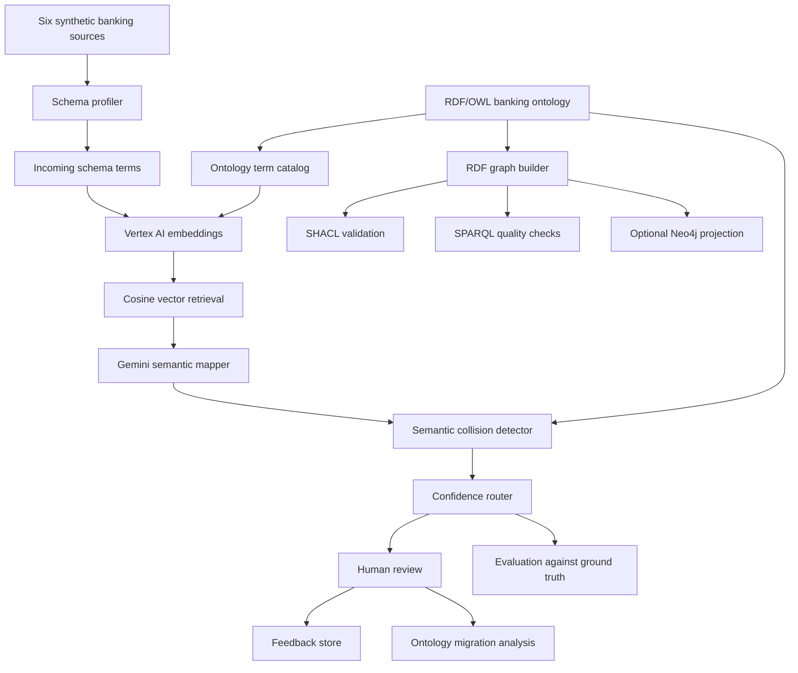

# GSIS Architecture

## Objective

The Graph Schema Intelligence System governs how fields from independent banking platforms enter a shared semantic model. Its central design decision is to separate evidence generation from ontology governance: embeddings and Gemini recommend mappings, while deterministic rules, collision checks, confidence routing, and human review control whether those recommendations are accepted.

## End-to-end flow

## Component responsibilities

### Source simulation and profiling

Stage 1 creates deterministic synthetic data for Cards, Core Banking accounts, Core Banking customers, CRM, Fraud, and Payments. The sources deliberately use different names for related concepts and include known quality defects. Stage 2 profiles 49 fields and identifies likely schema overlaps before any model call.

### Ontology and graph construction

The banking ontology defines concepts such as `Party`, `Customer`, `Merchant`, `FinancialProduct`, `Account`, `Card`, `Transaction`, and `RiskEvent`, plus domain/range relationships. The recorded ontology contains 269 triples. Stage 4 converts the synthetic records into a 41,799-triple RDF graph.

### Deterministic validation

SHACL validates structural and datatype constraints. SPARQL checks detect missing referenced entities and duplicate identifiers. The recorded run produced five SHACL violations and three failing SPARQL quality rules. These are expected because the generator injects learning examples such as an orphan customer reference and an invalid currency.

### Semantic candidate generation

Stage 7 uses `gemini-embedding-001` with 768 output dimensions. Ontology definitions are embedded as retrieval documents; incoming terms are embedded as retrieval queries. Stage 8 calculates cosine similarity and retains the top three candidates. The score is a retrieval signal, not a probability.

### Model-assisted mapping

Stage 9 provides Gemini 2.5 Flash with the incoming term and vector candidates. The model returns a structured recommendation, reuse/create action, semantic score, and explanation. The application stores the response in CSV for traceability.

### Governance controls

Stage 10 compares model recommendations with ontology constraints and expected semantic roles. Stage 11 combines 40% vector similarity and 60% Gemini semantic confidence, then applies collision penalties and routing thresholds. A collision is treated as a governance signal rather than merely another model score.

The recorded run routed all 12 mappings to review: five to soft review and seven to human escalation. This conservative behavior produced 0% auto-approval coverage and a 100% human-intervention rate.

### Human review and feedback

Reviewers can approve, remap, or approve creation of a new concept. The recorded feedback includes:

- `merchant_ref`: remapped to the existing `Merchant` concept;
- `subject`: remapped from generic `Party` to `Customer`;
- `mobile_wallet`: approved as the new `DigitalWallet` concept.

The feedback store makes reviewed outcomes available to future retrieval or few-shot prompting.

### Migration analysis and serving

Stage 13 estimates the impact of replacing deprecated concepts. The demonstration assessed replacing `Client` with `Customer` and reported 500 replacement instances with low migration risk. Stage 14 optionally projects selected records into Neo4j for graph exploration; the RDF graph remains the validation source of truth.

### Evaluation

Stage 15 joins 12 predictions with labeled ground truth. The recorded pre-review mapping accuracy is 66.67%, collision recall is 50%, and the false-auto-approval rate is 0 because nothing was automatically approved. These measurements describe a small learning dataset and should not be generalized to production performance.

## Design choices

### Hybrid reasoning

Vector retrieval narrows the search space, Gemini interprets business meaning, RDF/OWL supplies explicit semantics, and SHACL/SPARQL enforce deterministic quality rules. No single component is trusted as the sole decision maker.

### Human-in-the-loop routing

Uncertain mappings do not silently modify the ontology. The pipeline records confidence, collision evidence, routing decisions, and reviewer outcomes so a governance team can audit why a concept was reused or created.

### Reproducibility

The data generator uses fixed random seeds. Generated inputs, labeled ground truth, intermediate artifacts, and final metrics are retained in the repository so the recorded evaluation can be inspected without rerunning paid cloud stages.

### Safety boundaries

Credentials come from environment variables. Neo4j database deletion is opt-in through `NEO4J_CLEAR_DATABASE=true`. Generated data is synthetic, but cloud stages still transmit schema descriptions to Vertex AI and should be reviewed before use with real enterprise metadata.

## Improvements for a production version

1. Expand and stratify the labeled mapping set.
2. Calibrate confidence thresholds using precision-recall curves.
3. Add ontology aliases and relationship-aware candidate scoring.
4. Version prompts, model IDs, datasets, and ontology changes together.
5. Add automated unit, integration, and regression tests.
6. Store review decisions in a transactional service rather than CSV.
7. Add access control, audit logging, lineage, PII classification, and secret management.
8. Deploy RDF and Neo4j loading through idempotent jobs with rollback support.

