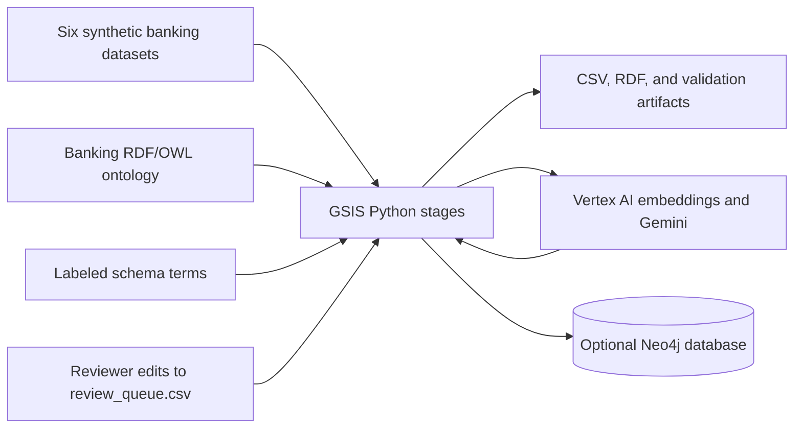
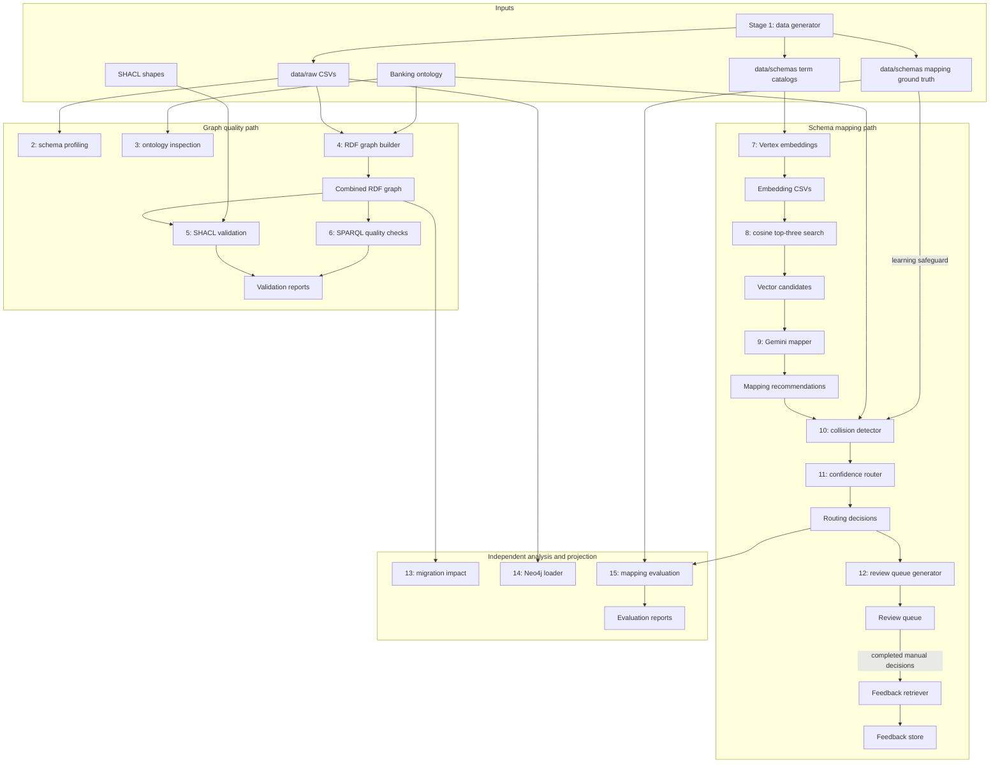

# GSIS architecture

GSIS is a file-based learning pipeline with two main paths: graph validation and schema mapping. Both start from generated banking data, but they serve different questions. Validation asks whether the graph satisfies business constraints. Mapping asks which ontology concept an incoming term should use. Evaluation measures the mapping path against a small labeled dataset.

## System context

The local filesystem is the pipeline's state store. Scripts read and overwrite named files under `data/` and `outputs/`; there is no scheduler, service API, or transactional review store. Vertex AI is used only by stages 7 and 9. Neo4j is optional and does not feed the mapping evaluation.

## Implemented data flow

Arrows show file dependencies, not an automatically orchestrated run. Stage numbers describe the learning sequence. The profile output is useful for inspection, but the current embedding stage reads the term catalogs generated by stage 1 directly. The feedback file is produced after a reviewer completes rows in the queue; the mapper does not read that feedback automatically on a later run.

## Component contracts

| Boundary | Reads | Writes | Current behavior |
|---|---|---|---|
| Source preparation | Fixed-seed generator | Six raw CSVs, term catalogs, ground truth | Recreates the synthetic example data. |
| Profiling | Raw CSVs | `data/processed/` | Reports 49 fields and overlap candidates. |
| RDF graph | Raw CSVs, ontology | `outputs/rdf/` | Creates the banking graph and a graph combined with the ontology. |
| Graph checks | Combined graph, SHACL shapes | `outputs/validation/` | Reports violations; it does not repair source records. |
| Embeddings | Term catalogs, Google Cloud credentials | Two embedding CSVs | Uses `gemini-embedding-001` with 768 dimensions. |
| Retrieval | Embedding CSVs | `vector_candidates.csv` | Cosine similarity, top three per incoming term. |
| Semantic mapping | Vector candidates, Vertex AI | `gemini_mappings.csv` | Gemini 2.5 Flash recommends concept and action. |
| Collision and routing | Mapping CSV, ontology, labeled truth | Collision and routing CSVs | Applies ontology checks, ground-truth comparison, 40/60 score blend, and routing rules. |
| Review | Routing CSV, manual CSV edits | Review queue, auto approvals, feedback store | The generator initially writes `PENDING` rows. A completed queue is a separate manual state. |
| Migration analysis | Combined RDF graph | `deprecation_impact.csv` | Fixed `Client` to `Customer` demonstration. |
| Neo4j projection | Raw customer, account, transaction CSVs | Neo4j nodes and relationships | Independent property graph load; it is not a conversion of the validated RDF artifact. |
| Evaluation | Routing CSV, labeled truth | Evaluation CSVs | Measures pre-review recommendations on 12 terms. |

## Decision path

The mapper chooses `REUSE`, `CREATE_NEW`, or `REVIEW`. The collision detector checks whether a reused class exists in the ontology and compares the recommendation with `mapping_ground_truth.csv`. That comparison is appropriate for this labeled exercise, but it leaks the evaluation answer into the routing path. Production collision detection would need to rely on ontology constraints, field context, and approved mapping history without reading ground truth.

The router computes `0.40 × top_vector_score + 0.60 × semantic_score`. A collision caps confidence at `0.49`; `REVIEW` caps it at `0.69`. `CREATE_NEW` and collisions go to `HUMAN_ESCALATION`. Otherwise, scores of at least `0.90` are eligible for `AUTO_APPROVE`, scores from `0.70` to below `0.90` go to `SOFT_REVIEW`, and lower scores go to `HUMAN_ESCALATION`. These are hand-set demonstration thresholds, not calibrated probabilities.

The recorded run sent all 12 terms to review and approved none automatically. The queue generator creates empty reviewer fields and marks them `PENDING`. The committed queue contains completed decisions entered later; rerunning `review_manager.py` would overwrite those entries unless they are preserved elsewhere. `feedback_retriever.py` combines completed reviews with automatic approvals into `feedback_store.csv`.

## Deployment and trust boundaries

- `data/raw/` contains synthetic people and transactions. The same workflow would need data classification and access controls before use with real banking records.
- Stages 7 and 9 send term descriptions and mapping context to Google Vertex AI. Application Default Credentials and the project ID come from the local environment.
- Stage 14 connects to the Neo4j URI with environment-supplied credentials. `NEO4J_CLEAR_DATABASE=true` enables a full database reset; the default is false.
- CSV and RDF files are local artifacts. There is no cross-stage transaction, versioned run manifest, or automatic rollback.

## Recorded results and interpretation

The repository records 4,450 synthetic source rows, 49 profiled fields, 269 ontology triples, and 41,799 triples in the combined RDF graph. The graph checks found five SHACL violations and three failing SPARQL rules. The 12-term pre-review mapping evaluation reports `0.6667` accuracy, `0.5` collision recall, `0.0` auto-approval coverage, and `1.0` human-intervention rate.

`auto_approval_precision` and `false_auto_approval_rate` are stored as zero when there are no automatic approvals. They are not statistically measured precision or error rates for an auto-approved group. The review decisions are recorded separately from the pre-review evaluation.

## Architecture changes for a production implementation

1. Isolate ground truth so only the evaluation job can read it; replace the stage 10 label comparison with ontology and approved-history rules.
2. Give each run an immutable ID and version its inputs, ontology, prompt, model, configuration, and outputs together.
3. Store reviewer decisions in a durable service with audit history, and make reruns preserve completed decisions.
4. Apply approved ontology changes explicitly, with validation and rollback before publishing a new ontology version.
5. Calibrate routing on a larger held-out set and report precision only when a decision category has observations.
6. Make Neo4j an explicit projection from an approved graph if RDF and Neo4j are intended to represent the same state.
7. Add orchestration, idempotent stage execution, failure handling, secrets management, and access controls before processing real data.
